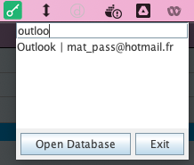

# Keepass Tray - by please-open.it

**This is a prototype**

This little app is a small client for [keepass](https://keepass.info), that gives access to your Keepass database directly from
the system tray (Mac, Windows, Linux).


Search for a password, click on the entry to copy it in the system clipboard.



Supports databases with password and keys protection.

## Build

```bash
mvn clean compile assembly:single
```

## Run

```bash
java -jar ./target/KeepassTray-1.0-SNAPSHOT-jar-with-dependencies.jar
```

